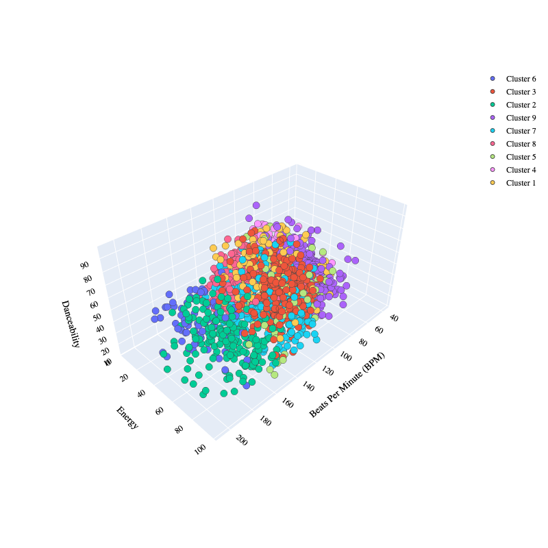

# Clustering Music Genres
Using a dataset of popular songs on Spotify, which contains artists and music names with all audio characteristics of each music. I have grouped music genres based on similarities in their audio characteristics.
  
